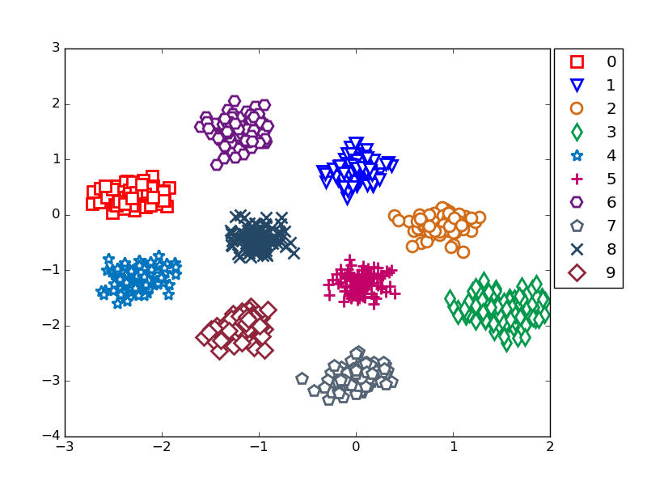

# Triplet Net + Label-spreading
## Abstract  
triplet net(loss func is Deep Ranking one) + Label-spreading  

## Requirements
-Python (checked python2.7.6)  
-Chainer(checked chainer 1.15)  
-scikit-learn(checked scikit-learn 0.17.1)  
-matplotlib(checked matplotlib 1.5.1)  

## How to use
python implement_all.py  

## Result
Get feature vectors dumped by pickle and a vectors image extracted by Triplet Net.  
  
